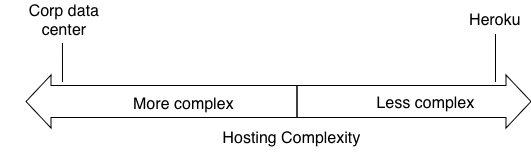
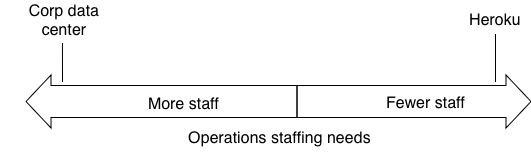
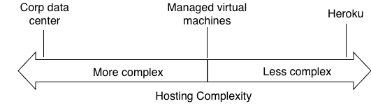
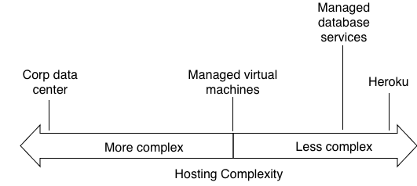

Once upon a time, I had a colleague tell me “DevOps is a culture, not a job title”. This was early 2016, when the idea of DevOps was still relatively new in engineering culture. My general world view at that time was that developers shouldn’t have anything to do with infrastructure, because how could they possibly understand it? So as you can imagine, my colleague’s message went right over my head.

Fast forward nearly 8 years later, and DevOps Engineer, Cloud Engineer, Infrastructure Engineer are different names of the same role whose popularity continues to grow, if my LinkedIn InMail messages are any indication. So it might seem strange that I’m describing it as broken. Maybe my colleague was wrong?

## How the DevOps Engineer was born

I think to understand what’s going on we need to go back to the beginning and the origins of DevOps.

DevOps was originally envisioned to solve the “throw-it-over-the-wall” problem between developers and operations. So engineering leaders at big tech companies started advocating for the pattern [“You build it, you run it”](https://aws.amazon.com/blogs/enterprise-strategy/enterprise-devops-why-you-should-run-what-you-build/). The problem DevOps tries to solve for is much clearer when considering a time when applications were primarily on-premises. This might be best visualized on a spectrum of hosting solutions.

Obviously, this complexity chart aligns with ops staffing requirements.

Where the waters got muddied was with the introduction of the “Cloud”. The industry attempted to introduce a new computing paradigm at the same time it was attempting to introduce a new operational model. The cloud eliminated the data center and turned infrastructure into APIs.

When this happened at major enterprise companies, the traditional data center ops position was eliminated and managers needed to find new roles for these engineers. Since the cloud was entirely API based, and interacting with the cloud is generally programmatic, a new role was born: the DevOps engineer, so named because it’s an operations person that was expected to do development work (generally writing Python scripts).

Coincidentally, what might be surprising is the same position was being built from the other end of the spectrum: startups. While the enterprise might have set the pattern for “DevOps Engineers”, startups (and startups inside enterprises) might have contributed more to the raw number of DevOps Engineers in the industry.

When a startup is created, again either standalone or inside a larger company, they are naturally started without engineers dedicated to infrastructure or non-product development. The complexities of the application generally don’t demand it, and the business doesn’t have the budget to staff such a role unless it’s a particularly complex/high scale application. So developers either use a fully managed platform such as Heroku or end up handling all tasks themselves including CI/CD, building infrastructure, and operational monitoring/scaling.

However as the application grows in functionality, one of two things generally happens:
1. The application outgrows the fully managed platform it was built on (like Heroku)
2. The overhead of non-product tasks requires more time or skills than the development team has available to it.

The first job req is then created for a “DevOps Engineer”, usually before the overall engineer count hits 10. Regardless of either startup or enterprise created, this new DevOps Engineer generally has the same set of technologies they’re expected to handle:
1. CI/CD, including:
	2. Infrastructure as code
	3. Continuous Integration (CI) server maintenance/configuration
	4. Continuous Deployment (CD) configuration
	5. In some cases, even handling the actual deployments
6. Ongoing infrastructure management including, but not limited to
	7. Virtual machines
	8. Databases/data store
		9. Updates
		10. Scaling
		11. Replication
	12. Container builds
	13. Networking
14. Operational monitoring and alarms
15. Security monitoring
16. Any third party/external integrations and configuration

The first thing you might notice is this is a long set of responsibilities. In terms of *quantity* of work, this list is multiplied every time there’s a new discrete stack/service. In many cases, it’s natural for a discrete stack/service to also need at least some technologies distinct from the original. That adds another dimension for new skills requirements for the DevOps Engineer, or the requirement to hire yet another DevOps engineer.

This brings us to how DevOps as a concept is broken. Because the DevOps Engineer is not *just* contributing to these technologies, the DevOps Engineer is also assigned *ownership* and *responsibility* for all of these technologies. This is also an engineer who, generally, is on a different team and supporting multiple engineering teams.

To understand the ownership problem, let’s analyze a couple scenarios.
## Simple Scenario: PostgreSQL 11 is getting end of life’d and needs to be upgraded to the version 16
The work involved here can be broken down into two parts:
1. Ensuring application compatibility
2. Upgrading to PostgreSQL 16

For the sake of this scenario, we’ll assume we’re using a managed database service from a cloud provider such as AWS RDS or Azure Database for PostgreSQL. With these managed database services, the actual upgrade process is fully managed by the cloud providers such that the only action by the user required is changing a configuration variable from 11 to 16. Looking at our operational complexity diagram, we can see these services are pretty far to the right.

On the application side there’s a lot more work to upgrade local development environments, upgrade unit tests, and most likely doing some manual QA to ensure critical user paths are unaffected.

When it actually comes time to do the upgrade, the change will happen on the infrastructure side so you might assume the best way to execute this would be to have the DevOps Engineer own the change, possibly after hours, monitor for any downtime, and then execute a rollback if needed. However, this would now mean an engineer from a completely different team who has very little context on the overall scope of the change as it relates to the application would be responsible for managing this process from end to end.

This clearly adds risk and complications to the entire process. It also contributes to a much lower bus factor for the database version management. And the question that should be asked is: Is it necessary given the fully managed database? If upgrading the database is as simple as flipping a version number variable, shouldn’t the application team manage the entire process themselves? And possibly leverage the support of the cloud provider as necessary.

Now you might say: “Sure, but that’s a simple scenario, what about a more complicated one?” So let’s take a look at a slightly more complex scenario from one of the most common requirements: CI/CD. We’ll look at two different ways to approach this problem: The traditional ops way and the DevOps way.

## Complex Scenario: A developer needs to build a new feature in an existing service that involves a new time-series data store that requires a new integration test and the test framework has new dependencies that need to be installed in CI/CD.

This one is a doozy! Hopefully the TPM split it up into multiple stories ;)

Let’s break this down into potential technologies involved and some high level tasks for it.

### Technologies involved:
1. Time-series database (eg. Cassandra)
2. Terraform (resources to deploy Cassandra)
3. Selenium for integration and end-to-end testing
4. Jenkins - Updated CI steps to run integration tests
5. CQL language-specific library for data layer access to Cassandra

To simplify this scenario and make it more generically applicable, we’ll also assume there are no engineers in the company with any prior experience with the technologies involved.

### Testing Tasks:
1. POC Selenium
2. Create Selenium sample tests
3. Create Jenkins build step to run tests

### Product/Feature Build Tasks
1. Create POC database in the cloud using a managed Cassandra service
2. Build POC application using CQL library
3. Add cloud Cassandra resource to Terraform
4. Add complete Selenium tests so they’re executed by build step

### Traditional Ops Approach
Using the traditional ops approach, the ops team would be responsible for most of this work, potentially including writing the Selenium tests, depending on the product team. The only thing the product team would be responsible for is writing the application code to connect to Cassandra.

At this point you might be saying “We don’t have an ops team, we have a DevOps team”. But from experience, DevOps teams tend to mirror the operational models of traditional ops teams pretty closely. And you might not realize it, but what you’ve built, probably inadvertently, is a traditional throw-it-over-the-wall model.

#### Challenges with traditional ops approach

There’s been plenty of ink spilled about the dangers of this approach. But the highlights are:
1. Organizational scalability issues
2. Resistant to change and lack of agility ([Dev]Ops teams will generally only want to support technologies they’re comfortable with)
3. Siloed teams with poor communication, especially during high severity incidents
4. Slow release cycles
5. Complex ownership models

### DevOps Model
In the DevOps model, the product team would be responsible for owning delivery of the project end to end. The DevOps team would sit with the product team during story grooming and breakdown to understand where the biggest pain points would be including skills gaps and non-product development overhead. The DevOps team would then add any tasks to their backlog that would reduce the overhead for the product team. This could be anything from simple scripts, to libraries, to full API services. Those tasks would then be prioritized based on ROI and time to market to support the product team.

In this approach, anything delivered by the DevOps team would be owned by the DevOps team in a shared-libraries model. The key difference from the ops model is that the product team, upon receiving those deliverables, then take ownership and responsibility of those deliverables in production, including any underlying infrastructure components they create.

This might sound foreign to many product teams, but is no different to how developers use open source libraries today. They’d look for libraries that support their speed/simplicity of development, but then by default accept ownership to build, deploy, and monitor their code in production. If they need help, they’d then open issues on GitHub with their support needs.

## Conclusion

At the risk of belaboring the point, I think there’s an apt analogy here that especially developers might find relatable.

These days, we take for granted a lot of the frameworks that we have. Spring, Django, Rails, React (and Angular before that). What I think people tend to forget is that there was a time before them in the late 90s and early 2000s, and it involved a lot of [LAMP](https://en.wikipedia.org/wiki/LAMP_(software_bundle)) stacks. These stacks were very raw. Besides PHP having no API framework (you had to go to Java for that), there were no PHP ORMs. So you ended up writing a lot of raw SQL.

This consumed a lot of developer hours, way more developer hours than managing the Rackspace VMs that were available for application hosting at that time. And yet, developers were expected to work around this problem and build their own libraries to solve for this.

This is the same model that DevOps is intended to emulate. If you look at the DevOps model next to the operational complexity, you’ll notice it’s not a perfect match, even using all “serverless” cloud services.

However, what I would suggest, is that it’s a small cost worth accepting by product teams. And if you have a good DevOps team, they should be able to make that cost so small to be worth the trade off on things like agility, time to market, etc.

So what should we rebrand DevOps Engineer as? I leave that open to discussion. Before DevOps, they used to just be called “Builder/developer tools”. But regardless of what the role is called, step 1 is admitting we have a problem. We can work on [naming](https://martinfowler.com/bliki/TwoHardThings.html) later.

Stay tuned for follow up articles. I’ll deep dive on specific DevOps tooling and how all of this is related to microservices.

