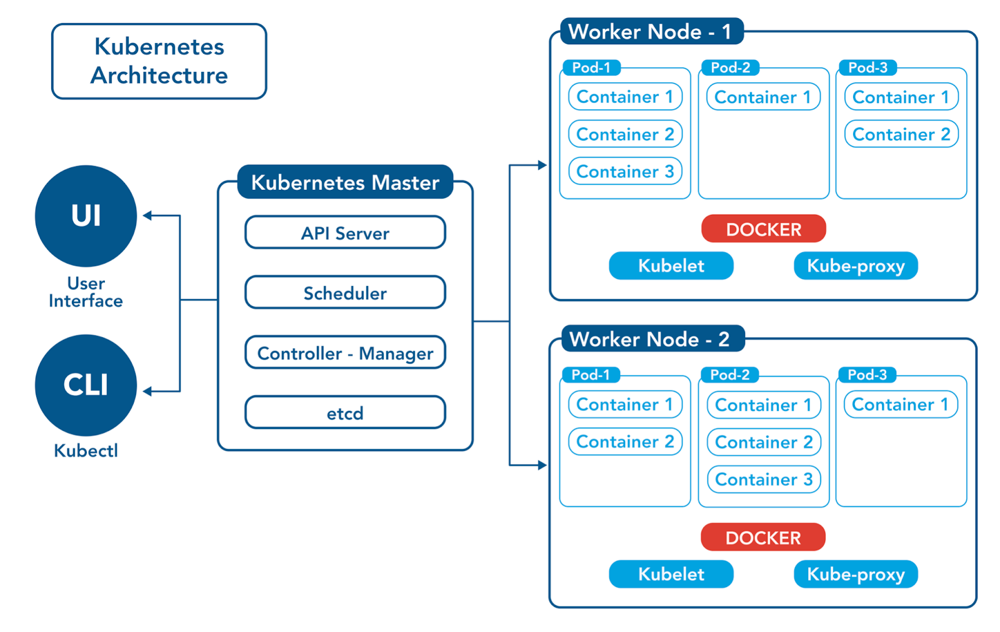
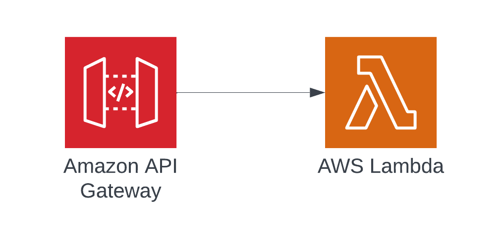

A common financial recommendation for high net worth individuals and $100+ million companies is to [diversify bank accounts](https://www.cnet.com/personal-finance/banking/savings/why-you-should-own-multiple-savings-accounts/). The cost/benefit on this strategy is a no-brainer. While bank failures are rare, especially large bank failures, it’s simple enough to transfer money between banks that spreading assets across multiple banks has practically no cost with meaningful and potentially company-saving benefits. 

Similarly, in software engineering, redundancy is a core principle of well-architected system design. We ensure data is duplicated multiple times then stored in cold storage. And we scale our application servers horizontally and use load balancers to distribute requests to available servers.

So it’s natural that the next logical step corporate executives would think to take is creating redundancy across infrastructure providers, also known as a “multi-cloud strategy.” While this step is also about creating application availability/redundancy, it goes one step further to attempt to create redundancy at the vendor/business level in addition to the technical level. 

However, it’s telling that usually the people driving multi-cloud strategies is the C-Suite and not engineers on the ground. 
Running a multi-cloud application is substantially more complex than maintaining several bank accounts. So let’s analyze the business justifications why executives say their companies need to be multi-cloud and break down some of the technical implications in doing so.

## The Business Justifications
### ABC Cloud Provider Might Go Out of Business
Somehow, this is by far the most common reason I hear from CTOs/heads of engineering for why they need to be multi-cloud. Generally, this is explained under the need of “business continuity”. “What happens if ABC cloud vendor goes out of business tomorrow?” Ironically, I’ve heard this from companies of all sizes, even companies that haven’t been around as long as the cloud vendors themselves.

There’s no data to show what it would look like if a cloud vendor did go out of business, as it hasn’t happened yet. Also, the current three major cloud providers (AWS, Azure, GCP) are all owned by companies making massive profits. In the case of AWS and Azure, those divisions are actually the driver of much of their company’s profits. So much of the arguments here are theoretical and difficult to directly address. 

However, humoring for a moment the “going-out-of-business” argument, it’s hard to imagine a scenario where all the data centers of a cloud vendor just go dark overnight. Even if one of the big three decided to [stop its cloud business](https://www.theinformation.com/articles/google-brass-set-2023-as-deadline-to-beat-amazon-microsoft-in-cloud), that would inevitably be a very long drawn out process. There would be plenty of time, at least a year if not more, for a move to another vendor. Even Rackspace, which once was a leader in cloud servers but long ago fell way behind the big three, still hosts servers.

### ABC Cloud Vendor Might Increase Prices
Unlike the last concern, this is at least an argument rooted in some historical data, though not necessarily from the big three. Executives who make this argument are most likely worried about reliving pain from price increases from companies like Oracle and SAP (and probably pre-Azure Microsoft).

Realistically, inflation being what it is, this is always a possibility. However, prices have been generally observed to go down across cloud vendors, not up, or at least stay flat (which is down counting inflation). For this article, a well-known industry expert in cloud cost management was consulted who echoed the experience that, at least for AWS, the current largest cloud vendor, they have never directly increased prices of an offering.

There’s a lot of competition in the cloud market today and that doesn’t seem to be slowing down. For at least the past 10 years, cloud providers have been in a land grab for market share. They’re not just fighting each other, but trying to get customers out of data centers. Given the environment, it makes price increases still mostly untenable. For example, it’s probably not a coincidence that AWS and Azure decided to drop their prices on object storage around the same time in 2021 after Google did earlier in the year.

That’s very different from the software environment 15-20 years ago when one or two companies dominated entire categories of software. They were also able to extract exorbitant licensing fees because of extreme lock-in. This brings us to our next section.

### Prevent Lock-In
The lock-in concern typically comes from the use of proprietary technologies inside a cloud environment. The thinking here is usually either a) Using proprietary technologies would make switching hard or b) Using cloud-agnostic technologies would allow an application to run active-active, or at least active-passive across multiple clouds, again, think: multiple bank accounts.

The technologies in question here can be broken down into 3 parts: CI/CD, the application stack, observability/security monitoring. These components are usually lumped into the “multi-cloud” conversation, but without the nuance of how differently lock-in applies to them.

#### Continuous Integration (CI) and Continuous Deployment (CD)
CI/CD is composed of several layers of technology. 

CI is typically a workflow engine of some type. Examples include Jenkins, GitHub Actions, Travis CI, AWS CodeBuild, and Azure DevOps. These workflow engines are generally cloud-agnostic/multi-cloud since they are essentially just script runners and can be used with most major git hosting services. They also generally use the same constructs (jobs, steps, etc) in either YAML (most common) or Groovy, in the case of Jenkins.

CD is composed of both a workflow engine (often the same one used in CI), and the actual deployment code. The deployment code (in modern terms, Infrastructure as Code, or IaC) is often where people raise the concern around being cloud agnostic. Technology leaders looking for “cloud-agnostic” IaC libraries often point to options such as Terraform, Pulumi, the Salt stack, etc. This is in contrast to tools such as AWS CloudFormation or Azure Resource Manager.

To better understand lock-in as it relates to IaC, let’s imagine you’ve built a standard 3-tier web application on AWS with Terraform using ALB, EKS, and RDS and decide to move it to Azure. Even with Terraform, you’d still end up rewriting the entire app as there’d be an entirely new provider backend and completely different resources to go with it. Besides Azure and GCP obviously having completely different APIs, configuration would be very different, especially with GCP and KNative. If instead you had originally written the app with CloudFormation, the only real difference is that you’d have to spend a few extra days picking up the mostly syntax and structure differences between HCL and JSON/YAML. However, since both CloudFormation and Terraform at their core are essentially declarative low-level representations of cloud APIs, the code would be relatively familiar.

So for IaC, the lock-in really amounts to how long it would take your engineers to pick up a new IaC library (small plug for how the CDK can help bridge this gap). That should be weighed against any cons of not using the cloud provider’s native tooling. For example, a cloud provider’s native tooling will have better enterprise support options, is generally better integrated with the cloud provider’s platform, and will have more readily available sample code/documentation. In the case of IaC tooling, this also means fully managed state management instead of DIY state providers or paying for something like Terraform Enterprise or Pulumi.

Finally, there is one important consideration for IaC somewhat related to multi-cloud that might swing the decision one way or the other. Since open-source tools like Terraform have broader support for more cloud APIs, if your application is using tools from multiple cloud providers, you *might* benefit from a tool like Terraform. An example might be if you’re running a front end application using a combination of CloudFlare and S3. That said, even in that scenario, CloudFormation [might be](https://aws.amazon.com/blogs/devops/extending-cloudformation-and-cdk-with-third-party-extensions/) a good option for you, too.

The bottom line is that the library itself isn’t really the main thing that would lock you into one cloud or another. And multi-cloud shouldn’t be the primary consideration for picking an IaC library.

#### The Application Stack
This section could probably be an entire blog post in and of itself. So it might be simplest to summarize this using examples from two extreme ends of the spectrum.

A fully cloud-agnostic web API would have to use pretty much nothing other than raw virtual machines. Presumably, most people are not suggesting that, at least not these days. 

A more common, practical cloud-agnostic workload might look like using an open-source container scheduler for your containerized application, with Kubernetes being the most popular option. This might be paired with a managed ingress load balancer in front of it, depending on your architecture needs. 

While popular, Kubernetes is an extremely complex system with a lot to learn. 


Even just building the local Dockerfile following best practices and a CI/CD pipeline for container publishing can require a lot of work and new skills. This is what it takes just to get an example Node app running locally. 

```
# Stage 1: Building the application
FROM node:18 AS builder

WORKDIR /usr/src/app

# Copy package.json and package-lock.json
COPY package*.json ./

# Install dependencies
RUN npm install

# Copy source files
COPY . .

# Build the application
RUN npm run build

# Stage 2: Preparing the production image
FROM node:18-slim

WORKDIR /usr/src/app

# Copy package.json and package-lock.json
COPY package*.json ./

# Install only production dependencies
RUN npm install --only=production

# Copy built files from the builder stage
COPY --from=builder /usr/src/app/build ./build

# Copy other necessary files like views, public folder, etc.
# Uncomment and modify according to your application's structure
# COPY views ./views
# COPY public ./public

# Expose the port the app runs on
EXPOSE 3000

# Define the command to run the app
CMD ["node", "build/app.js"]

```


The operational overhead can get even more burdensome when you start to add either more services or more components to services and need technologies like in-memory caching, queues, message brokers, etc. Technically, many of these tools have managed open source versions in many clouds, but they can still  be complex to scale and manage, and/or still require complicated integration processes, including authentication and authorization. One classic example of this is Kafka. Kafka can help make your application multi-cloud, but at the cost of huge operational overhead.

On the other end of the spectrum we have “serverless” stacks. Serverless can mean different things depending on not just the cloud vendor, but even within a cloud vendor across different products. That said, serverless is generally both a management construct and, just as importantly, a billing construct. 

For billing, it generally implies *per request* pricing, or at the minimum, pricing based on higher level constructs such as request rate, not CPU/memory/storage. This billing model can make serverless architectures far more cost effective for new/low-traffic services.

For management, these products are fully managed by the cloud vendor and, at most, require version number-type configurations. 

As an example, the first, and likely still most popular serverless stack is API Gateway -> Lambda -> Dynamo on AWS. Azure and GCP have their own flavors of this. In some cases, an application might go as far as using a fully managed platform like Heroku, Google App Engine, etc.

Besides the two benefits I already mentioned, there’s actually one more benefit to these stacks that is probably the most important of all: Operational simplicity. For reference, here’s an example of an AWS serverless application:

{: .normal .me-2 .w-75 }

As you can see, this stack has much fewer moving parts than the previously referenced Kubernetes application and a much simpler deployment/configuration process. This results in a lower time-to-market, especially for engineering teams that don’t have the resources to dedicate to operational overhead. Serverless stacks enable developers with very little to no background in infrastructure management to build applications quickly, securely, and highly scalably.

This benefit and overall simplicity becomes evident when we put our serverless diagram next to our Kubernetes diagram.

{: .normal .me-2 .w-75 }
{: .normal .w-75 }

In theory, a large enterprise with a dedicated platform engineering team could overcome some these challenges and build their own Platform-As-A-Service in a cloud-agnostic way. However that would generally require the enterprise to be much further along the cloud maturity path than most probably are. Additionally, the resources required to properly staff such a platform engineering team should not be understated. It’s essentially reproducing the engineering teams that the major cloud vendors have already built. 

And it raises the practical question:<br>
*Isn’t eliminating undifferentiated heavy-lifting unrelated to business value why everyone is jumping out of their data centers to begin with?*

#### Observability/Security Monitoring
This category is maybe the least controversial of the bunch. Enterprises need to monitor applications across multiple cloud platforms, so cloud-agnostic tools are essentially required. 

Even for startups, there’s not a lot of lock-in risk here. Vendors such as Datadog, Splunk, and New Relic are designed to sit on top of cloud APIs and ingest data from cloud/application logs. So generally switching from either a cloud vendor’s native tools to a cloud-agnostic one or even between these tools is relatively easy, with the notable exception of moving alarms and dashboards and potentially application instrumentation.

To highlight this point, at many companies I’ve observed that it’s common practice for a developer to bounce back and forth between AWS’s native CloudWatch Logs and a 3rd party log ingestion service. That’s because generally all of the data available to the cloud providers is available to the 3rd parties. 

## Final Thoughts - Pay Now vs Pay Later?

I’ve recently heard building cloud-agnostic tooling as being described as “pay now vs pay later”. 

This might imply that tech debt is being accrued because it’s inevitable that the company will have to move to a different cloud vendor. That, of course, is not necessarily true or at least not in the way people might think, as described above.

However, you could take the opposite view of “pay now vs pay later” using the 401k model. The reason why every financial advisor tells you to invest in a 401k, is because you’ll pay less taxes later when you’re retired. Attempting to build zero lock-in into an application is like not using a 401k because you assume you’ll be making more money in retirement than you do now. You might, but you probably won’t. 

Similarly, by attempting to make your application cloud-agnostic, you’re making a bet, and a very potentially large one at that, that not only are you going to need to change cloud vendors, but that if you do, it will be at a riskier/costlier time for the business than right now. You’re also betting that if that change does need to happen, the company won’t have time to plan the migration at their own pace. This bet comes at the expense of delivering real business value *today*. 

So in a very real sense, you’re gambling that you have more money to spend on tech debt today than you will later. At least as far as startups go, this is never true. The early days of a company are critical times for a company to deliver business value above all else. 

In the case of enterprises, they still need to focus on delivering business value. However, it might be tempting for them to think they have the resources to build their own platform. Consider this: do you think you have the all the skills, experience, and resources of the major cloud vendors to reproduce what they’re doing? Does it make sense for you to spend the money required to build that talent in-house?

For me, the math just doesn’t add up. Certainly, there’s some things that might be easy wins in the cloud-agnostic game, observability tooling and database backups just as a couple examples. And for sure, as the company grows, it’s worth keeping an accounting of the multi-cloud “tech debt” that’s being collected. But my suggestion is to be very deliberate about how it’s paid off. 

Bottom line, optimize for today’s needs and don’t add complexity for needs that may not come…but keep an ear to the ground just to be sure.


